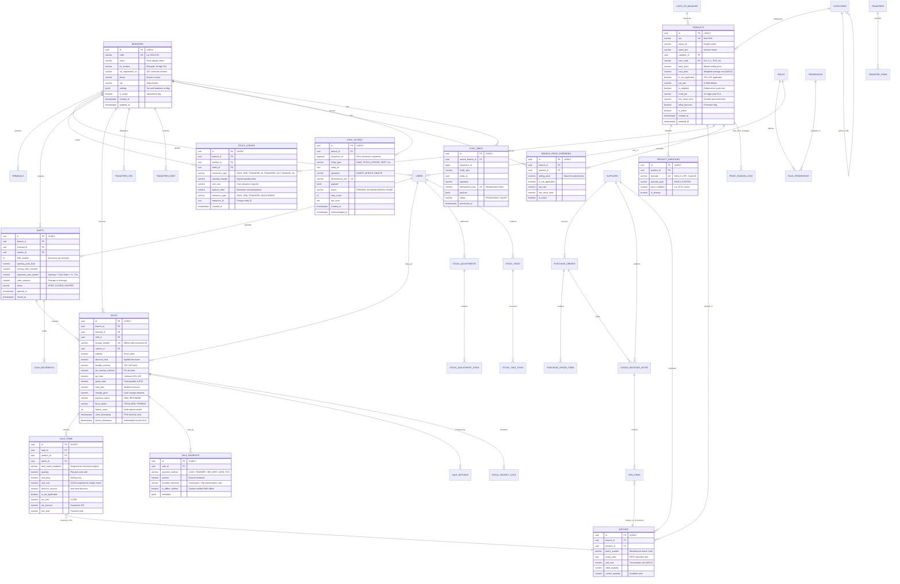

# GebeyaOS: Entity-Relationship Diagram (ERD)

```mermaid
erDiagram
    BRANCHES ||--o{ TERMINALS : operates
    BRANCHES ||--o{ USERS : assigns
    BRANCHES ||--o{ STOCK_LEDGER : tracks
    BRANCHES ||--o{ SHIFTS : contains
    BRANCHES ||--o{ SALES : executes
    BRANCHES ||--o{ TRANSFERS_SRC : dispatches
    BRANCHES ||--o{ TRANSFERS_DEST : receives
    BRANCHES ||--o{ BRANCH_PRICE_OVERRIDES : sets
    BRANCHES ||--o{ SYNC_OUTBOX : queues
    BRANCHES ||--o{ SYNC_INBOX : logs

    CATEGORIES ||--o{ PRODUCTS : categorizes
    CATEGORIES ||--o{ CATEGORIES : parent_child

    UNITS_OF_MEASURE ||--o{ PRODUCTS : measures

    PRODUCTS ||--o{ PRODUCT_BARCODES : identifies
    PRODUCTS ||--o{ BATCHES : tracked_in
    PRODUCTS ||--o{ STOCK_LEDGER : movements
    PRODUCTS ||--o{ BRANCH_PRICE_OVERRIDES : overrides
    PRODUCTS ||--o{ PRICE_CHANGE_LOGS : logs_price_changes

    SUPPLIERS ||--o{ PURCHASE_ORDERS : receives
    SUPPLIERS ||--o{ GOODS_RECEIVED_NOTES : supplies
    SUPPLIERS ||--o{ BATCHES : originates

    PURCHASE_ORDERS ||--o{ PURCHASE_ORDER_ITEMS : contains
    PURCHASE_ORDERS ||--o{ GOODS_RECEIVED_NOTES : fulfills

    GOODS_RECEIVED_NOTES ||--o{ GRN_ITEMS : contains
    GRN_ITEMS }o--|| BATCHES : creates_or_increments

    ROLES ||--o{ ROLE_PERMISSIONS : defines
    PERMISSIONS ||--o{ ROLE_PERMISSIONS : assigned_to
    ROLES ||--o{ USERS : role_of

    USERS ||--o{ SHIFTS : operates
    USERS ||--o{ SALES : rings_up
    USERS ||--o{ STOCK_ADJUSTMENTS : authorizes
    USERS ||--o{ STOCK_TAKES : conducts

    SHIFTS ||--o{ SALES : contains
    SHIFTS ||--o{ CASH_MOVEMENTS : audits

    SALES ||--o{ SALE_ITEMS : contains
    SALES ||--o{ SALE_PAYMENTS : paid_by
    SALES ||--o{ SALE_REFUNDS : refunded_by
    SALES ||--o{ FISCAL_RECEIPT_LOGS : fiscalizes
    SALE_ITEMS }o--|| BATCHES : consumes_fefo

    TRANSFERS ||--o{ TRANSFER_ITEMS : specifies

    STOCK_ADJUSTMENTS ||--o{ STOCK_ADJUSTMENT_ITEMS : contains
    STOCK_TAKES ||--o{ STOCK_TAKE_ITEMS : reconciles

    BRANCHES {
        uuid id PK "UUIDv7"
        varchar code UK "e.g. BOLE-01"
        varchar name "Store display name"
        varchar tin_number "Ethiopian 10-digit TIN"
        varchar vat_registration_no "VAT certificate number"
        varchar phone "Branch contact"
        varchar city "Addis Ababa"
        jsonb settings "Tax and hardware configs"
        boolean is_active "Operational flag"
        timestamptz created_at
        timestamptz updated_at
    }

    PRODUCTS {
        uuid id PK "UUIDv7"
        varchar sku UK "Item SKU"
        varchar name_en "English name"
        varchar name_am "Amharic name"
        uuid category_id FK
        varchar uom_code FK "KG, G, L, PCS, etc."
        numeric base_price "Master selling price"
        numeric cost_price "Weighted average cost (AVCO)"
        boolean is_vat_applicable "15% VAT applicable"
        numeric vat_rate "0.1500 default"
        boolean is_weighed "Deli/produce scale item"
        varchar scale_plu "4-5 digit scale PLU"
        numeric min_stock_level "Reorder point threshold"
        boolean allow_discount "Promotion flag"
        boolean is_active
        timestamptz created_at
        timestamptz updated_at
    }

    PRODUCT_BARCODES {
        uuid id PK "UUIDv7"
        uuid product_id FK
        varchar barcode UK "EAN-13, UPC, Code128"
        varchar barcode_type "EAN13, CUSTOM"
        numeric pack_multiplier "e.g. 24 for carton"
        boolean is_primary
    }

    BRANCH_PRICE_OVERRIDES {
        uuid id PK "UUIDv7"
        uuid branch_id FK
        uuid product_id FK
        numeric selling_price "Branch localized price"
        boolean is_vat_applicable
        numeric vat_rate
        numeric min_stock_level
        boolean is_active
    }

    BATCHES {
        uuid id PK "UUIDv7"
        uuid branch_id FK
        uuid product_id FK
        varchar batch_number "Manufacturer batch code"
        date expiry_date "FEFO allocation key"
        numeric unit_cost "True landed cost (AVCO)"
        numeric initial_quantity
        numeric current_quantity "Available units"
    }

    STOCK_LEDGER {
        uuid id PK "UUIDv7"
        uuid branch_id FK
        uuid product_id FK
        uuid batch_id FK
        varchar movement_type "SALE, GRN, TRANSFER_IN, TRANSFER_OUT, DAMAGE, etc."
        numeric quantity_change "Signed quantity delta"
        numeric unit_cost "Cost valuation snapshot"
        numeric balance_after "Monotonic running balance"
        varchar reference_type "SALE, GRN, TRANSFER, ADJUSTMENT"
        uuid reference_id "Foreign entity ID"
        timestamptz created_at
    }

    SALES {
        uuid id PK "UUIDv7"
        uuid branch_id FK
        uuid terminal_id FK
        uuid shift_id FK
        varchar receipt_number UK "Offline-safe monotonic ID"
        uuid cashier_id FK
        numeric subtotal "Gross sales"
        numeric discount_total "Applied discounts"
        numeric taxable_subtotal "15% VAT base"
        numeric tax_exempt_subtotal "0% tax base"
        numeric tax_total "Collected 15% VAT"
        numeric grand_total "Final payable in ETB"
        numeric total_paid "Tendered amount"
        numeric change_given "Cash change returned"
        varchar payment_status "PAID, REFUNDED"
        varchar fiscal_status "FISCALIZED, PENDING"
        int reprint_count "Audit reprint tracker"
        timestamptz client_timestamp "POS terminal clock"
        timestamptz server_timestamp "Authoritative branch time"
    }

    SALE_ITEMS {
        uuid id PK "UUIDv7"
        uuid sale_id FK
        uuid product_id FK
        uuid batch_id FK
        varchar item_name_snapshot "Snapshot for historical integrity"
        numeric quantity "Physical units sold"
        numeric unit_price "Selling price"
        numeric unit_cost "COGS snapshot for margin report"
        numeric discount_amount "Item-level discount"
        boolean is_vat_applicable
        numeric tax_rate "0.1500"
        numeric tax_amount "Computed VAT"
        numeric line_total "Final line total"
    }

    SALE_PAYMENTS {
        uuid id PK "UUIDv7"
        uuid sale_id FK
        varchar payment_method "CASH, TELEBIRR, CBE_BIRR, CARD_POS"
        numeric amount "Amount tendered"
        varchar provider_reference "Transaction / Slip authorization code"
        boolean is_offline_verified "Cashier verified SMS offline"
        jsonb metadata
    }

    SHIFTS {
        uuid id PK "UUIDv7"
        uuid branch_id FK
        uuid terminal_id FK
        uuid cashier_id FK
        int shift_number "Monotonic per terminal"
        numeric opening_cash_float
        numeric closing_cash_counted
        numeric expected_cash_system "Opening + Cash Sales + In - Out"
        numeric cash_variance "Overage or shortage"
        varchar status "OPEN, CLOSED, AUDITED"
        timestamptz opened_at
        timestamptz closed_at
    }

    SYNC_OUTBOX {
        uuid id PK "UUIDv7"
        uuid branch_id FK
        bigserial sequence_no "Strict monotonic sequence"
        varchar entity_type "SALE, STOCK_LEDGER, SHIFT, etc."
        uuid entity_id
        varchar operation "INSERT, UPDATE, DELETE"
        varchar idempotency_key UK
        jsonb payload
        varchar status "PENDING, ACKNOWLEDGED, FAILED"
        int retry_count
        text last_error
        timestamptz created_at
        timestamptz acknowledged_at
    }

    SYNC_INBOX {
        uuid id PK "UUIDv7"
        uuid source_branch_id FK
        bigint sequence_no
        varchar entity_type
        uuid entity_id
        varchar operation
        varchar idempotency_key UK "Deduplication index"
        jsonb payload
        varchar status "PROCESSED, FAILED"
        timestamptz processed_at
    }
```
